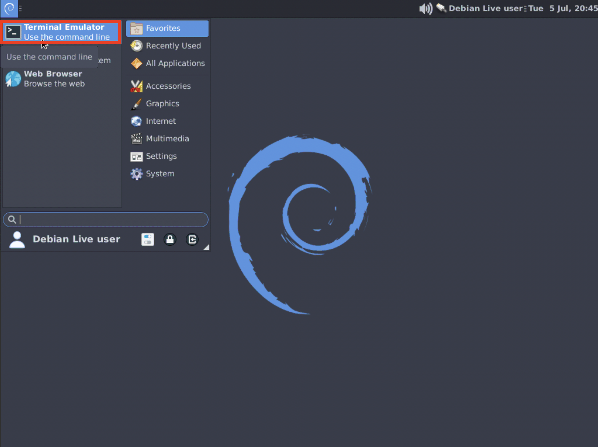

This article relies on the live media [created here](/live-sessions/linux-live-session).

Stressful Application Test is a memory testing tool, notably used by Google.

## Running the test
1. After you boot into the media, click the Debian logo in the top-left corner, then click "Terminal Emulator" to open the terminal:

2. In the terminal, do the following:
    - Install StressAppTest via the terminal by typing:
  
        ```bash
        apt install stressapptest
        ```
    - Run the application by typing `stressapptest -W -s <time>`. Replace `<time>` with the time in seconds that you want to run the test for. We suggest an hour, so the command would be `stressapptest -W -s 3600`. Then press Enter to actually run the command.

        ```bash
        stressapptest -W -s 3600
        ```

> [!NOTE] StressAppTest Killed
>
> Sometimes, the linux OOM (Out-Of-Memory) killer stops memory-intensive processes to prevent system-wide lockups when it runs out of RAM. In this case, it will kill StressAppTest.
>
> On low memory systems, implement a RAM limit on `stressapptest` by adding the `-M` flag: `stressapptest -W -s <time> -M <memory>`.
>
> An example would be (run StressAppTest for 1 hour, allocate 4 GB of memory):
> ```bash
> stressapptest -W -s 3600 -M 4G
> ```