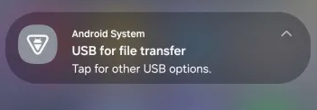

# No network available on the device
If you have installed/reinstalled Windows, and notice you do not have any WiFi/Ethernet drivers available to connect to the internet, or your WiFi/Ethernet device has stopped working leaving you with a device incapable of connecting to the network, you can temporarily provide network access to the device in question via USB Tethering.

This involves utilizing the network capabilities of a smartphone and using it as a WiFi dongle.

## Android with Windows, Linux or ChromeOS
This is the easiest method to enable USB tethering without the need of any other drivers or tool. The process is relatively straightforward and almost plug-and-play. The only changes needed to be done is on the Android phone only.

> [!IMPORTANT] Mac computers can't tether with Android by USB!
> The following method will only work with Windows, Linux and ChromeOS computers. Due to proprietary communication standards between Apple and other devices, the user will require a iPhone to attempt USB tethering with Apple devices.

1. Connect your phone to the other device with a USB cable. A notification will show up at the top of the screen. Swipe down to reveal the notification in more detail:
    
2. Select it, and from the options, select USB Tethering under the section titled "Use USB for".
    

> [!NOTE] Note
> Sometimes the USB tethering options may be hidden in another menu on other android phones. The other most common area this setting will be present in is in Settings > Connections/Hotspot > USB Tethering.
>
> Alternatively, searching up "USB Tethering" within the settings app will also reveal the options accordingly.

## iPhones with other devices
This can be slightly more complicated depending on what device you are connecting to.

> [!IMPORTANT] Turn on Personal Hotspot on iPhone/iPad
> Before you try to connect this to any device, make sure your iOS or iPadOS device has its Personal Hotspot turned on (to check, go to Settings > Personal Hotspot on your device). Note that this is dependant on the carrier you may be using for the device.

### iPhones with Macs
If you own an iPhone or iPad and need to set up networking for a Mac, the USB tethering process is far more straightforward as both utilize the same proprietary communication standards set forth by Apple.

1. Connect your iPhone or iPad to your Mac with the USB cable that came with your device.
2. If you see an alert on your iPhone or iPad that says “Trust This Computer?” tap Trust.
    

### iPhones with Windows
If you wish to connect an iPhone or iPad to a Windows device, you will need to ensure that [iTunes](https://www.apple.com/ca/itunes/) is preinstalled on the device, as it will contain the necessary drivers which enables iOS to communicate with Windows.

> [!IMPORTANT] iTunes cannot be installed in OOBE
> During the installation of Windows (OOBE), installation of iTunes may not be possible and you may have to resort to other means of providing networking capabilities to your system.
>
> Also note you cannot install iTunes via the iPhone as file transfer between iPhones and Windows devices will also not work without iTunes as a pre-requisite.

Once that prerequisite is complete, you may proceed with the following steps:
1. Open up the "Settings" app on your iPhone.
2. Tap on "Cellular" or "Mobile Data," depending on your iOS version.
3. Look for "Personal Hotspot" and tap on it. Turn on the toggle switch for that setting.
4. You may see a prompt to enable Wi-Fi and Bluetooth. You can choose to enable them or use USB only, depending on your preference.
5. Connect your iPhone to your Windows PC using a USB cable.
6. On your Windows machine, you may be prompted to enter the password for the connection. This is the same password as you would have set in Personal Hotspot.

### iPhones with Linux
If you use a Linux distribution, please refer to the following guides depending on your install:

#### Ubuntu/Debian
Ensure you have the following drivers/packs installed beforehand and ensure they are enabled:
- `libimobiledevice6`
- `usbmuxd`

To install these, simply enter the following into a terminal:

```bash
sudo apt install usbmuxd libimobiledevice6 libimobiledevice-utils
```

Once that is done, simply follow the steps as outlined above in [iPhones with Macs](/guides/usb-tethering/#iphones-with-macs).

> [!NOTE] Note
> Ubuntu 24.04 and later would have drivers installed and enabled by default to support Apple devices.

#### Fedora/CentOS (8 and later)
Ensure you have the following drivers/packs installed beforehand and ensure they are enabled:
- `libimobiledevice6`
- `usbmuxd`

To install these, simply enter the following into a terminal:

```bash
sudo dnf install usbmuxd libimobiledevice6 libimobiledevice-utils
```

> [!NOTE] What if I don't use DNF?
> If you utilize a different package manager such as Yum (CentOS 7 or earlier) and do not have access to dnf, use the following command instead:
> 
> ```bash 
> sudo yum install usbmuxd libimobiledevice6 libimobiledevice-utils
> ```

Once that is done, plug in the iPhone with a USB to the computer. Then run the following command:

```bash
sudo idevicepair pair
```

This will cause the iPhone to receive a prompt on screen: "`Do you want to trust this computer?`". Enter the passcode after pressing "Yes".

Run the above `idevicepair pair` command again, which should result in successful pairing of the iPhone with the laptop. This pairing should be remembered after disconnecting and reconnecting the phone.

From here, follow the steps as outlined above in [iPhones with Macs](/guides/usb-tethering/#iphones-with-macs).

#### Arch/EndeavorOS/CachyOS

Please refer to the [official Arch wikipedia](https://wiki.archlinux.org/title/IPhone_tethering) to carry out USB tethering with an iPhone.

### iPhones with ChromeOS
Currently there are no solutions as Chromebooks do not natively support USB tethering with iPhones, nor is there any official iTunes application for ChromeOS.

Please utilize an Android phone instead or utilize a USB Wifi Dongle.